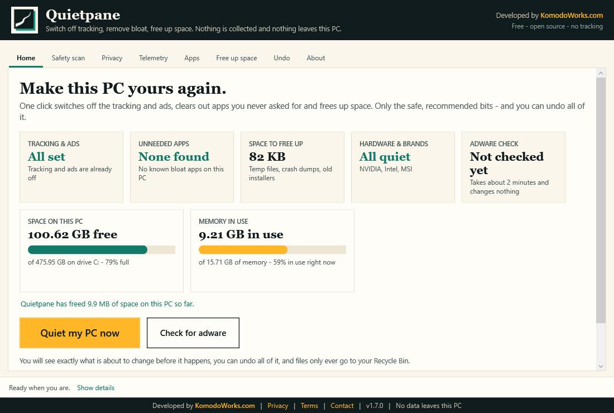

<p align="center">
  <a href="https://www.komodoworks.com"></a>
</p>

<h1 align="center">Quietpane</h1>

<p align="center">
  <b>Take your Windows PC back.</b><br>
  Switch off the tracking, clear out the bloat your PC came with, free up space. Everything happens on your PC, and nothing leaves it.<br><br>
  Developed by <a href="https://www.komodoworks.com"><b>KomodoWorks.com</b></a> &middot; Free &amp; open source (MIT) &middot; Windows 10 / 11
</p>

<p align="center">
  <a href="https://github.com/kgntmr/quietpane/releases/latest/download/Quietpane.zip"><b>⬇&nbsp;&nbsp;Download Quietpane</b></a> &nbsp;(one small ZIP file)
</p>

---

## Get started in 3 steps

1. **[Download Quietpane](https://github.com/kgntmr/quietpane/releases/latest/download/Quietpane.zip)**.
2. **Unzip it:** right-click the downloaded **Quietpane.zip** → **Extract All** → **Extract**. *It can't start from inside the ZIP.*
3. In the new **Quietpane** folder, double-click **Start Quietpane**, then press **Quiet my PC now**.

It tells you what it will do before it does anything, takes about a minute, and has an **Undo everything** button. You never need to open the *App files* folder.

> **A good start, not a guarantee.** Quietpane tidies up the usual troublemakers and switches off tracking you never agreed to. It can't promise a PC is clean. If yours still feels wrong afterwards, run a deeper scan with a dedicated security tool as well.

<p align="center"></p>

**Windows will ask a few questions first.** That's normal for new free software:

| Windows says | Click |
|---|---|
| "Windows protected your PC" | **More info** → **Run anyway** |
| "Do you want to run this file?" | **Run** |
| "Do you want to allow this app to make changes?" | **Yes** |

Quietpane isn't digitally signed yet, so Windows doesn't recognise the publisher. We've applied for free code signing (see [Code Signing Policy](#code-signing-policy)). Every file is plain text you can read in Notepad.

**Opened a window full of code, or Windows asked "How do you want to open this file?"** You opened one of the app's own files. Close it, pick nothing, and double-click **Start Quietpane** instead.

Just want a check-up that changes nothing? Double-click **Safety scan only**. Want to be sure your download is genuine? [Here's how](SECURITY.md#check-that-your-download-is-genuine).

**Requirements:** Windows 10 or 11 and an administrator account. Nothing is installed.

---

## Why this exists

Almost everything on a modern PC reports home: Windows, browsers, graphics drivers, and the software your laptop maker pre-installed. Most people never knowingly agreed to any of it, and plenty of "cleaner" tools collect data of their own.

- 🔒 **Collects nothing.** No accounts, analytics, telemetry, crash reports, ads or tracking.
- 🌐 **Connects to nothing.** No network requests at all: [verify it yourself](#verify-it-yourself).
- 👀 **Tells you first.** Every item explains what it does and its side effects, and **Preview** shows exactly what would change.
- ↩️ **Can be undone.** Every change creates a restore point, and tidying up only ever moves files to your Recycle Bin. Only a threat you choose to delete for good is gone for good, and you're asked twice.
- 📖 **Hides nothing.** Plain-text PowerShell, no installer, no `.exe`, no obfuscation.
- 🛡️ **Leaves your security alone.** Defender, SmartScreen, the firewall and Windows Update are never touched.

It grew out of a real clean-up of a gaming laptop, where adware kept re-installing itself from a scheduled task that came in with a cracked game. Those [lessons](docs/LESSONS-LEARNED.md) are built into the tool.

---

## What's inside

### Home
Cards show what could be better on this PC, two bars show free space and memory in use, and one button does the lot. **Quiet my PC now** applies only the recommended items that aren't done yet, all inside **one** restore point, so **Undo everything** really does undo everything. It never uninstalls a program on its own.

### Telemetry: the extras your PC came with
Laptop makers and chip makers leave software running in the background. Quietpane looks for what's actually on **your** PC and lists only that, so nothing shows up for brands you don't have.

Supported today: **NVIDIA, Intel, AMD, MSI, ASUS, Dell, HP, Lenovo, Acer**. For each one it can switch off background reporting, auto-updaters and scanning helpers. **Drivers are never touched and the brand's own app still works.** Extras that are safe to remove, like an offers app, are listed separately and unticked: Quietpane removes one only if you tick it and confirm, and it warns you first that an uninstall can't be undone. Adding a brand needs no code, just an entry in [`src/catalog/vendors.psd1`](src/catalog/vendors.psd1).

NVIDIA is a special case: deleting its telemetry plugin breaks NVIDIA App, so Quietpane blocks the telemetry servers instead. We [found that out the hard way](docs/LESSONS-LEARNED.md#nvidia-app-telemetry-cannot-be-deleted).

### Privacy
32 settings in five collapsed sections: Windows telemetry, privacy, ads and tips, background services, and browsers and other software (Edge, Chrome, Office, Intel DTT, VS Code, .NET and PowerShell). Anything already done says so.

### Safety scan
Two things at once: **what Microsoft Defender has found**, and Quietpane's own look around for the tricks adware uses. Looking changes nothing.

While it runs, a line shows which step it's on, what it's looking at, how many things it has seen and how long it's been going. **Stop** ends it cleanly at the next safe point, changes nothing and writes no report.

Results come back as a doughnut chart with a written legend, and a card for each finding. Click a severity to show only those. Every card says **who found it** and **how sure that is**:

- **Microsoft Defender** - a real detection with a real threat name. Quietpane translates the name into plain words and sorts it into Critical, High, Medium, Low or Info. Defender's own name and classification stay on the card.
- **Quietpane check** - our own heuristics: odd startup entries, hidden tasks, tampered programs, cracked-software traces. These are **signals, not proof**, and they never claim a malware family.

Each finding with a real file behind it gets three buttons:

- **Remove it** asks how: let **Defender** handle it (safest, and Windows Security can restore it), **quarantine** it with Quietpane, move it to the **Recycle Bin**, or **delete it permanently**. Permanent deletion is the only thing Quietpane cannot undo, so it asks twice and says so plainly.
- **Quarantine** moves the file somewhere it cannot run. The original path, times and SHA256 are recorded, the folder is locked to administrators, and **Put it back** restores the file byte-for-byte after checking the hash still matches. Quarantined items are listed in the same tab.
- **Leave it for now** warns that it stays on the PC. It's a note in Quietpane only: **it never creates a Defender exclusion** and never weakens a future scan.

Before anything is moved or deleted, Quietpane re-checks that the file is still there and still the same file, and refuses outright in Windows, Program Files and driver folders. Every action, including every failure, is written to `%ProgramData%\Quietpane\audit.log`.

When it's done, a short summary says what was looked at, what was found by severity, what you've dealt with so far - removed, quarantined, recycled, deleted, left alone, or failed - and the one thing worth doing next.

**Quietpane cannot identify a malware family by itself.** Without Defender, only the heuristics run, and the scan says so rather than implying the PC is clean.

| Check | What it looks for |
|---|---|
| Microsoft Defender detections | Everything Defender has found, quarantined or removed, named by Defender and explained in plain words |
| Startup entries and tasks | Items that open websites, run hidden scripts or re-create themselves. Entries pointing to programs that no longer exist are flagged as leftovers. |
| **"What installed this?"** | For anything suspicious, the folders created within 3 minutes of it. That's usually the culprit. |
| Hidden persistence | WMI event consumers, IFEO hijacks, Winlogon changes, AppInit_DLLs |
| Network | Hosts-file redirects, proxies, DNS servers |
| Files | Unsigned programs in user folders, **modified signed programs**, traces of cracked software |
| Browsers | Extensions that can read every site, and sites allowed to push notifications |
| Security and privacy | Defender status, suspicious exclusions, firewall, settings still switched on |
| Brand software | What your laptop and chip makers left running, and extras you could remove |
| Performance and space | Memory use, what really starts at sign-in, space you could reclaim, folders nothing has touched in 6+ months |

### Apps, Free up space, Undo, About
**Apps** offers only known bloat that's actually installed; Store, Camera, Photos, Calculator, Notepad, Paint, Snipping Tool and anything driver-related are never offered. **Free up space** lists temp files, crash dumps, caches and old installers with their sizes, and moves them to the Recycle Bin. **Undo** restores services, tasks, registry values, environment variables, VS Code settings and hosts entries exactly as they were. **About** holds the policies, readable offline.

---

## Verify it yourself

**1. Read it.** The whole app is `Quietpane.ps1` (the window), `src/Quietpane.psm1` (the engine) and `src/catalog/*.psd1` (the lists of settings, apps, folders and brands).

**2. Search for network code.** In the folder, run:
```powershell
Select-String -Path .\Quietpane.ps1, .\src\Quietpane.psm1 -Pattern 'Invoke-WebRequest|Invoke-RestMethod|WebClient|HttpClient|BitsTransfer|TcpClient|curl|wget|DownloadString'
```
You'll find exactly two matches, both in `src/Quietpane.psm1`, where `$suspiciousCmd` and `$suspiciousTask` are defined. They are the scanner's **detection patterns** - text it looks *for* in malicious startup entries, not network calls.

**3. Watch it.** Open **Resource Monitor** (`resmon`) → **Network** while you use the app. Nothing connects. Only your browser goes online, and only when **you** click a link.

**4. See what it keeps.** Restore points, logs and a small totals file live in `%ProgramData%\Quietpane`, and scan reports on your Desktop. Delete them whenever you like.

---

## What it deliberately does *not* do

| Not touched | Why |
|---|---|
| Defender, SmartScreen, firewall | Security |
| Windows Update | Keeps updates safe |
| Drivers, audio and chipset software | Your hardware has to keep working |
| The global "background apps off" switch | Breaks notifications for packaged apps |
| Blocking Microsoft servers in the hosts file | Breaks Windows Update, the Store and Defender |
| Deleting NVIDIA's telemetry plugin | Breaks NVIDIA App. Its servers are blocked instead. |
| Removing Microsoft Edge | Windows blocks it outside the EEA, and WebView2 must stay |
| Deleting anything behind your back | Clean-up and bloat removal always use the Recycle Bin. A confirmed threat can be deleted for good, but only when you pick that yourself and confirm it. |

Windows Home and Pro treat "diagnostic data = 0" as "Required", so the switch that actually works is disabling the DiagTrack service, which this tool does. Big Windows updates can quietly turn tips back on: run it again afterwards.

---

## Privacy, terms & security

- **[Privacy Policy](PRIVACY.md):** collects no personal data, makes no network connections.
- **[Terms of Use](TERMS.md):** free, open source, provided as is. Irish law, consumer rights unaffected.
- **[Security Policy](SECURITY.md):** reporting a vulnerability, and telling a genuine copy from a fake. **Only download from this repository's [Releases](https://github.com/kgntmr/quietpane/releases) page.**
- **[License](LICENSE):** MIT.

Quietpane is independent and not affiliated with or endorsed by Microsoft, NVIDIA, Intel, AMD or any PC maker. All trademarks belong to their owners.

---

## Code Signing Policy

Free code signing provided by [SignPath.io](https://about.signpath.io), certificate by [SignPath Foundation](https://signpath.org).

> **Status:** applied for in September 2026, waiting for approval. Until then releases are **not signed** and Windows shows "Unknown publisher". This section will say when signed releases start.

**What gets signed:** only files built from this repository's source by GitHub Actions and published on its [Releases](https://github.com/kgntmr/quietpane/releases) page. Every signing request is approved by hand.

| Role | Members |
|---|---|
| Committers and reviewers | [kgntmr](https://github.com/kgntmr) (KomodoWorks) |
| Approvers | [kgntmr](https://github.com/kgntmr) (KomodoWorks) |

**Privacy:** This program will not transfer any information to other networked systems unless specifically requested by the user or the person installing or operating it. Details: [Privacy Policy](PRIVACY.md).

---

## FAQ

**Chrome or Edge says "Managed by your organization".**
That appears whenever a browser policy is set, which is how the telemetry switches are locked. Nobody controls your browser, and Undo removes the policies.

**Some items say [not on this PC].**
That service, task or program isn't on your Windows version, or is already gone.

**How do I remove Quietpane?**
Removing it doesn't undo its changes: click **Undo** first if you want your PC back as it was. Then delete the Quietpane folder and any Quietpane-Report files on your Desktop. Nothing is installed, so that's all. Your undo history stays in `C:\ProgramData\Quietpane` until you delete that too.

---

## For developers

- **Run from source:** clone and double-click `Start Quietpane.cmd` (or `Safety scan only.cmd`).
- **Build the download:** `powershell -ExecutionPolicy Bypass -File tools\build-release.ps1` creates `dist\Quietpane.zip` and prints its SHA256. The ZIP holds exactly the files in this repo; nothing is compiled.
- **Test safely:** `.\Quietpane.ps1 -SelfTest` builds the window without showing it; add `-Snapshot file.png -SnapshotTab 0` to render it.
- **Run the tests:** `powershell -ExecutionPolicy Bypass -File tests\Run-QuietpaneTests.ps1`, or add `-Live` to include the EICAR check. Run it from an elevated window to include the quarantine tests. No real malware is used anywhere; the EICAR string is built at runtime, so it is never stored in this repository.
- **Check by hand:** [`docs/manual-checks.md`](docs/manual-checks.md) lists what a person still has to test in a browser and in the window, including the AMTSO feature checks. Those stay manual on purpose: automating them would mean the app downloading files, and it makes no network requests.
- **Contribute:** the lists are plain data files in [`src/catalog/`](src/catalog), so adding a setting, app, folder or brand needs no code. Describe side effects honestly and test with **Preview** first.

---

<p align="center">
  <a href="https://www.komodoworks.com"></a><br>
  <b>Developed by <a href="https://www.komodoworks.com">KomodoWorks.com</a></b><br>
  An independent technology studio in Dublin, Ireland: websites and apps, business systems, AI integration and data analytics.<br>
  Work directly with the person who scopes, builds and launches your project. &middot; <a href="https://komodoworks.com/en/contact">Get in touch</a>
</p>
